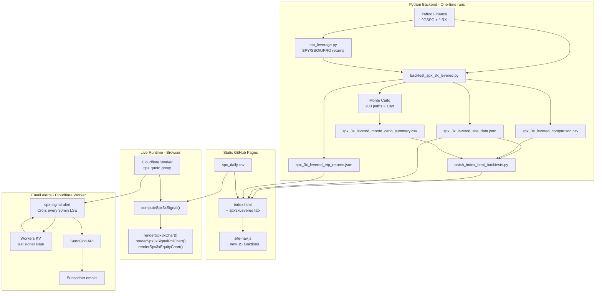

# S&P500 3x Levered Tab — Implementation Plan

> Generated from full source inspection of `index.html`, `site-nav.js`, `backtest_spx_guarded.py`, `patch_index_html_backtests.py`, `spx_guarded_site_data.json`, and `architecture_map.md`.
> Live site: https://rkarim25.github.io/Strategy/

---

## Architecture Decision: Where to Add the New Tab

**Recommendation: Add as a third top-level strategy container in `index.html`** (alongside `#guardedStrategy` and `#momentumStrategy`).

**Rationale:**
- The momentum strategy is already a second strategy in `index.html` — the pattern is established
- All three share the same SPX daily data pipeline (Cloudflare Worker, `spx_daily.csv`)
- All three share the same ETP return infrastructure (`etp-leverage.js`, `spx_etp_returns.json`)
- A separate HTML file would duplicate ~2000 lines of JavaScript (chart rendering, signal computation, refresh logic, ETP leverage)
- The `site-nav.js` sidebar already supports multiple strategies on the same page via `strategyNav` and `indexHref`

**Tradeoff acknowledged:** `index.html` will grow from ~3,558 lines to ~4,800+ lines. This is acceptable given the existing architecture already bundles two strategies.

---

## Strategy Logic Reference: B1–B4

| # | Strategy | CAGR | Max DD | Sharpe | Sortino | Avg Lev | Logic |
|---|----------|------|--------|--------|---------|---------|-------|
| B1 | SMA200 ±3% Band + RSI>30 Exit 3x | 20.85% | -53.2% | 0.669 | 0.737 | 3.0 | 3x when close > SMA200×(1+0.03); cash when close < SMA200×(1-0.03) OR RSI(14) < 30; otherwise hold prior state |
| B2 | SMA200 ±3% Band + RSI>30 Exit 2x | 17.17% | -38.4% | 0.713 | 0.785 | 2.0 | Same as B1 but 2x instead of 3x |
| B3 | SMA200 ±3% Band + RSI>30 Exit + RSI Scale 1-3x | 14.69% | -29.2% | 0.823 | 0.839 | 1.3 | RSI(14) maps to leverage: RSI≥70→3x, RSI≥55→2x, RSI≥40→1x, else cash; SMA200 band still gates |
| B4 | SMA200 ±3% Band + RSI>30 Exit + VIX Scale 1-3x | 15.36% | -31.3% | 0.786 | 0.791 | 1.3 | VIX level maps to leverage: VIX<15→3x, VIX<22→2x, VIX<30→1x, else cash; SMA200 band still gates |

**Default/featured strategy: B1** (highest CAGR at 20.85%, the headline strategy for this tab).

---

## A. New Tab HTML Structure

### A.1 Strategy Container Placement

Insert the new `<section id="spx3xLevered" class="strategy">` **between** the closing `</section>` of `#guardedStrategy` (line 1132) and the opening of `#momentumStrategy` (line 1134). The order in `index.html` will be:

1. `#guardedStrategy` (lines 634–1132)
2. **`#spx3xLevered` (NEW — inserted at line 1133)**
3. `#momentumStrategy` (lines 1134–1376)

### A.2 Hash ID and Page IDs

| Level | ID | Purpose |
|-------|-----|---------|
| Strategy container | `spx3xLevered` | Top-level CSS toggle via `.strategy.active` |
| Signal sub-page | `spx3xSignalPage` | Live signal, charts, calculator |
| Back-test sub-page | `spx3xBacktestPage` | KPIs, comparison tables, equity chart |
| Monte Carlo sub-page | `spx3xMonteCarloPage` | MC comparison, risk probabilities, diagnostics |

### A.3 Header Card (mirrors Guarded pattern, lines 635–647)

```html
<section id="spx3xLevered" class="strategy">
<section class="card" style="margin-bottom: 18px;">
  <h2>S&P 500 3x Levered — SMA200 ±3% Band + RSI(14) Guard</h2>
  <p>
    Strategies that hold 3x (or scaled 1x–3x) S&P 500 exposure when the close is above
    the 200-day SMA plus a 3% buffer, exit to cash when the close falls below the 200-day
    SMA minus a 3% buffer or RSI(14) drops below 30, and hold the prior state in the
    neutral zone between the bands. Backtests use listed US ETP daily returns (SPY/SSO/UPRO)
    for same-calendar accuracy; the execution vehicle is 3USL.L (UCITS 3x S&P 500).
  </p>
  <nav class="site-nav" aria-label="SPX 3x Levered strategy sections">
    <button type="button" class="active" data-page-target="spx3xSignalPage">Signal</button>
    <button type="button" data-page-target="spx3xBacktestPage">Back-test</button>
    <button type="button" data-page-target="spx3xMonteCarloPage">Monte Carlo</button>
  </nav>
</section>
```

### A.4 Signal Page (`#spx3xSignalPage`)

**Sections to include (simplified vs Guarded — no drawdown tiers, no calculator/optimizer):**

| Section | Content | Data Source |
|---------|---------|-------------|
| Strategy Rules card | Bullet rules for SMA200 ±3% band + RSI>30 exit logic | Hardcoded |
| Data Source card | Refresh button, manual SPX price input, status display | Same worker/static pipeline as Guarded |
| Official Signal (EOD) | Target leverage (0=cash, 1/2/3=levered), close, SMA200, RSI(14), band status, regime | New `computeSpx3xSignal()` |
| Live Intraday Signal | Same fields, provisional from live quote | Worker quote / manual input |
| SPX Close vs 200-Day SMA Chart | SVG 900×360 with ±3% band lines, trade markers, range controls | New `renderSpx3xPriceChart()` |
| Selected Window Equity P&L Chart | SVG 900×260 strategy vs SPX equity | New `renderSpx3xSignalPnlChart()` |
| Shared Strategy State | Latest date, SMA200 value, RSI(14) value, band upper/lower, current regime | `renderSpx3xState()` |
| Signal History Table | Last 20 signal changes with date, close, SMA200, RSI, action | Populated from `latestRows` + leverage array |

**Key differences from Guarded Signal page:**
- **No Guarded Strategy Calculator** (A/B/X/Y parameters don't apply to SMA200 band logic)
- **No Goal Seek / Optimizer** (the strategy has no tunable parameters beyond the 3% band and RSI threshold, which are fixed)
- **SMA200 instead of SMA20** — requires at least 200 rows of data (vs 20 for Guarded)
- **RSI(14) computation** — new client-side JavaScript function needed
- **±3% band lines** on the price chart — two additional horizontal-ish lines tracking SMA200×1.03 and SMA200×0.97

### A.5 Back-test Page (`#spx3xBacktestPage`)

| Section | Content | Patched? |
|---------|---------|----------|
| Back-test Overview | KPI cards for default B1 strategy (CAGR, max DD, Sharpe, Sortino, volatility, Calmar, end value, avg leverage) | **Yes** — from `spx_3x_levered_site_data.json` |
| Backtest Callout | Narrative comparing B1–B4 vs benchmarks | **Yes** — regex replacement |
| Top 20 Strategy Drawdowns | Client-side computed from B1 equity curve | No — computed by new `renderSpx3xTopDrawdowns()` |
| SPX vs B1 Strategy Equity Chart | SVG 900×360 rebased-returns comparison | No — new `renderSpx3xEquityChart()` |
| Full-Sample Strategy Comparison | B1–B4 + benchmarks (buy & hold 1x/2x/3x, SMA200 1x/cash, SMA200 3x/cash) | **Yes** — from `spx_3x_levered_comparison.csv` |
| Leverage Exposure Breakdown | Bar chart or table showing % days at each leverage level for B1–B4 | **Yes** — from site data JSON |
| Reference Benchmarks | Buy & hold 1x/2x/3x, SMA200 1x/cash, SMA200 3x/cash | **Yes** — from comparison CSV |

### A.6 Monte Carlo Page (`#spx3xMonteCarloPage`)

| Section | Content | Patched? |
|---------|---------|----------|
| Monte Carlo Validation | KPI cards (simulations=200, horizon=10yr, median CAGR, median max DD) | **Yes** — from site data JSON |
| Monte Carlo Comparison | B1–B4 comparison across 200 paths (median CAGR, P10/P90 CAGR, median max DD, P10/P90 max DD, median Sharpe, median end value, P(DD < -40%)) | **Yes** — from `spx_3x_levered_monte_carlo_summary.csv` |
| Risk Probabilities | P(DD < -35%), P(DD < -40%), P(DD < -50%), P(end below start) for B1 | **Yes** — regex from site data JSON |
| Default Strategy Diagnostics | Cash/1x/2x/3x days, rebalances, trading costs for B1 | **Yes** — from site data JSON |

---

## B. site-nav.js Modifications

### B.1 Add Page IDs

In `PAGE_IDS` (line 3), add:
```javascript
"spx3xSignalPage",
"spx3xBacktestPage",
"spx3xMonteCarloPage",
```

### B.2 Add Strategy ID

In `STRATEGY_IDS` (line 12), add:
```javascript
"spx3xLevered",
```

### B.3 Add Strategy Query Mapping

In `STRATEGY_QUERY` (line 20), add:
```javascript
spx3x: "spx3xLevered",
levered: "spx3xLevered",
```

### B.4 Add Section Pages

In `SECTION_PAGES` (line 218), add:
```javascript
spx3x: { signal: "spx3xSignalPage", backtest: "spx3xBacktestPage", monteCarlo: "spx3xMonteCarloPage" },
```

### B.5 Update `strategyForPage()`

Modify the function at line 157 to handle the new page IDs:
```javascript
function strategyForPage(pageId) {
  if (!pageId) return null;
  if (pageId.startsWith("momentum")) return "momentumStrategy";
  if (pageId.startsWith("spx3x")) return "spx3xLevered";
  if (PAGE_IDS.has(pageId)) return "guardedStrategy";
  return null;
}
```

### B.6 Update `activeNavId()`

Modify the function at line 206 to recognize the new strategy on index.html:
```javascript
function activeNavId(loc = location) {
  const page = currentPageFile(loc);
  if (page === "instruments.html") return "instruments";
  if (page !== "index.html") {
    const match = STRATEGY_NAV_ITEMS.find((item) => navItemPageFile(item) === page);
    return match ? match.id : null;
  }
  const pageId = pageFromLocation(loc);
  if (pageId && pageId.startsWith("momentum")) return "momentum";
  if (pageId && pageId.startsWith("spx3x")) return "spx3xLevered";  // NEW
  return "spx";
}
```

### B.7 Add Sidebar Nav Item

In `STRATEGY_NAV_ITEMS` (line 34), add a new entry in the "leveraged" group:
```javascript
{
  id: "spx3xLevered",
  asset: "S&P 500 3x",
  strategy: "SMA200 ±3% Band + RSI Guard",
  group: "leveraged",
  href: "index.html#spx3xSignalPage",
  indexHref: "#spx3xSignalPage",
  strategyNav: "spx3x",
},
```

### B.8 Update `hrefForItem()`

The existing logic at line 242 already handles `strategyNav` correctly — when `item.id === "spx3xLevered"`, it will call `pageForStrategy("spx3x", sectionOf(currentPageId))` which maps to the correct spx3x sub-page. No code change needed here beyond adding the `SECTION_PAGES` entry.

### B.9 Update `showStrategy()` in index.html

The `showStrategy()` function at line 1816 needs to handle the third strategy:
```javascript
function showStrategy(strategyId, options = {}) {
  document.querySelectorAll(".strategy").forEach((strategy) => {
    strategy.classList.toggle("active", strategy.id === strategyId);
  });
  const strategyNavKey = strategyId === "momentumStrategy" ? "momentum"
    : strategyId === "spx3xLevered" ? "spx3x"    // NEW
    : "guarded";
  document.querySelectorAll('[aria-label="Strategies"] [data-strategy-nav]').forEach((link) => {
    link.classList.toggle("active", link.dataset.strategyNav === strategyNavKey);
  });
  // ... rest unchanged
}
```

### B.10 Update `applyRouteFromLocation()`

The function at line 1852 needs the new strategy as a fallback option:
```javascript
function applyRouteFromLocation() {
  if (!window.SiteNav) return;
  const pageId = SiteNav.pageFromLocation();
  const strategyId = SiteNav.strategyFromLocation()
    || SiteNav.strategyForPage(pageId)
    || "guardedStrategy";
  if (!$(strategyId)) return;
  showStrategy(strategyId, { pageId: pageId || undefined, updateHash: false });
}
```
This already works because `strategyForPage()` will return `"spx3xLevered"` for spx3x page IDs.

---

## C. Backtest Data Generation

### C.1 New Script: `backtest_spx_3x_levered.py`

**File path:** `C:\Users\Reza Karim\OneDrive\Systematic_Backstester\backtest_spx_3x_levered.py`

**Structure (mirrors `backtest_spx_guarded.py`):**

```python
"""Backtest and Monte Carlo for S&P 500 3x Levered strategies (B1-B4).
Writes spx_3x_levered_site_data.json and spx_3x_levered_etp_returns.json.
"""

# Imports (same as backtest_spx_guarded.py)
# Constants:
SPX_TICKER = "^GSPC"
TBILL_TICKER = "^IRX"
YEARS = 30
OUTPUT_DIR = ROOT / "output" / "spx_3x_levered"
SITE_DATA_JSON = ROOT / "spx_3x_levered_site_data.json"
ETP_JSON = ROOT / "spx_3x_levered_etp_returns.json"  # Same ETP panel, different filename for consistency

N_SIMS = 200
HORIZON_DAYS = 2520
BLOCK_DAYS = 21
SEED = 20260619  # Different seed from guarded

# Strategy specs:
B1_SPEC = {
    "strategy": "SMA200 ±3% Band + RSI>30 Exit 3x",
    "sma_window": 200,
    "band_pct": 0.03,
    "rsi_window": 14,
    "rsi_exit": 30,
    "leverage": 3.0,
    "scale_mode": "fixed",  # fixed 3x
}
B2_SPEC = { ... "leverage": 2.0, "scale_mode": "fixed" }
B3_SPEC = { ... "leverage": 3.0, "scale_mode": "rsi", "rsi_scale": {70: 3, 55: 2, 40: 1} }
B4_SPEC = { ... "leverage": 3.0, "scale_mode": "vix", "vix_scale": {15: 3, 22: 2, 30: 1} }
```

**Key functions needed:**

1. `download_spx_panel(years)` — Same as existing, downloads ^GSPC + ^IRX
2. `compute_rsi(closes, window=14)` — Standard RSI computation (Wilder's smoothing)
3. `sma200_band_leverage(prices, spec)` — Core strategy logic:
   - Compute SMA200 and RSI(14) for each day
   - Upper band = SMA200 × (1 + band_pct), Lower band = SMA200 × (1 - band_pct)
   - If close > upper band → enter/hold leverage (3x for B1)
   - If close < lower band OR RSI < rsi_exit → cash
   - If between bands AND RSI ≥ rsi_exit → hold prior state (hysteresis)
   - For B3: scale leverage by RSI zones when in-market
   - For B4: scale leverage by VIX zones when in-market (requires VIX data download)
   - Returns: leverage array, counts dict (pct_days_cash/1x/2x/3x, rebalances)
4. `run_strategy(prices, spec, etp_returns)` — Same pattern as existing
5. `buy_hold_row(prices, leverage, label, etp_returns)` — Same as existing
6. `sma200_cash_leverage(prices, leverage)` — Simple SMA200 cash/levered toggle (no band, no RSI)
7. `monte_carlo(prices, etp_panel)` — Same pattern, runs B1–B4 through MC
8. `build_site_payload(prices, comparison, default_row, mc_summaries, etp_panel)` — Similar to existing but with B1–B4 array
9. `main()` — Orchestrates everything

**Output files:**
- `spx_3x_levered_site_data.json` — Site data payload
- `spx_3x_levered_etp_returns.json` — ETP return panel (same data as spx_etp_returns.json but with different filename for the patcher)
- `output/spx_3x_levered/spx_3x_levered_comparison.csv` — Full comparison table for patcher
- `output/spx_3x_levered/spx_3x_levered_default_backtest.csv` — B1 default row
- `output/spx_3x_levered/spx_3x_levered_monte_carlo_paths.csv` — 200×4 MC paths
- `output/spx_3x_levered/spx_3x_levered_monte_carlo_summary.csv` — MC summary for patcher

### C.2 JSON Schema for `spx_3x_levered_site_data.json`

```json
{
  "ticker": "^GSPC",
  "asset_label": "S&P 500",
  "strategy_params": {
    "strategy": "SMA200 ±3% Band + RSI>30 Exit 3x",
    "sma_window": 200,
    "band_pct": 0.03,
    "rsi_window": 14,
    "rsi_exit": 30,
    "base_leverage": 3.0
  },
  "sample": {
    "start_date": "1996-06-17",
    "end_date": "2026-06-15",
    "trading_days": 7547
  },
  "default_backtest": {
    "strategy": "SMA200 ±3% Band + RSI>30 Exit 3x",
    "cagr": 0.2085,
    "ann_volatility": 0.35,
    "sharpe": 0.669,
    "sortino": 0.737,
    "max_drawdown": -0.532,
    "calmar": 0.392,
    "end_$": 35000.0,
    "rebalances": 150,
    "trading_costs_total": 80.0,
    "funding_costs_total": 0.0,
    "pct_days_cash": 35.0,
    "pct_days_1x": 0.0,
    "pct_days_2x": 0.0,
    "pct_days_3x": 65.0,
    "avg_leverage": 1.95,
    "cagr_pct": "20.85%",
    "max_drawdown_pct": "-53.20%",
    "ann_volatility_pct": "35.00%",
    "sharpe_fmt": "0.669",
    "sortino_fmt": "0.737",
    "end_value_fmt": "$35,000",
    "calmar_fmt": "0.39"
  },
  "buy_and_hold_1x": { /* same as existing */ },
  "comparison_table": [
    /* B1, B2, B3, B4 + benchmarks */
  ],
  "strategies": {
    "b1": { /* full B1 row */ },
    "b2": { /* full B2 row */ },
    "b3": { /* full B3 row */ },
    "b4": { /* full B4 row */ }
  },
  "monte_carlo": {
    "n_sims": 200,
    "horizon_years": 10.0,
    "block_days": 21,
    "seed": 20260619,
    "method": "Block-bootstrap of joint historical segments...",
    "b1": {
      "strategy": "SMA200 ±3% Band + RSI>30 Exit 3x",
      "median_cagr": 0.15,
      "p10_cagr": 0.02,
      "p90_cagr": 0.28,
      "median_max_drawdown": -0.45,
      "p10_max_drawdown": -0.65,
      "p90_max_drawdown": -0.28,
      "median_sharpe": 0.55,
      "median_end_$": 5000.0,
      "prob_max_dd_worse_35pct": 0.70,
      "prob_max_dd_worse_40pct": 0.55,
      "prob_max_dd_worse_50pct": 0.30,
      "prob_end_below_start": 0.10,
      /* formatted versions */
    },
    "b2": { /* same structure */ },
    "b3": { /* same structure */ },
    "b4": { /* same structure */ }
  },
  "generated_at_utc": "2026-06-19T12:00:00Z",
  "levered_pnl_model": "Listed 2x/3x ETP daily returns (SPY/SSO/UPRO)...",
  "etp_coverage": { "pct_real_2x": 66.6, "pct_real_3x": 56.6 }
}
```

---

## D. Patching Logic

### D.1 New Patching Blocks in `patch_index_html_backtests.py`

Add the following new patching sections to the `main()` function (after the existing momentum sections, before the final write):

```python
# === SPX 3x Levered patching ===
SPX3X_SITE = ROOT / "spx_3x_levered_site_data.json"
SPX3X_COMP_CSV = ROOT / "output" / "spx_3x_levered" / "spx_3x_levered_comparison.csv"
SPX3X_MC_CSV = ROOT / "output" / "spx_3x_levered" / "spx_3x_levered_monte_carlo_summary.csv"

spx3x_site = json.loads(SPX3X_SITE.read_text(encoding="utf-8"))
spx3x_comp = pd.read_csv(SPX3X_COMP_CSV)
spx3x_default_name = spx3x_site["default_backtest"]["strategy"]

# 1. Full-Sample Strategy Comparison table
spx3x_full_rows = "\n".join(
    row_full_sample(r, bold=(r["strategy"] == spx3x_default_name))
    for _, r in spx3x_comp.iterrows()
)
html = replace_tbody(html, "<h2>Full-Sample Strategy Comparison</h2>", spx3x_full_rows)
# NOTE: This marker appears TWICE in the patched HTML (once for Guarded, once for SPX 3x).
# The replace_tbody function finds the FIRST occurrence. We need a way to target the second.
# SOLUTION: Use a unique marker. Change the SPX 3x heading to:
#   <h2>SPX 3x Full-Sample Strategy Comparison</h2>
# Or modify replace_tbody to accept an occurrence index parameter.

# 2. KPI cards for B1 default
bt3x = spx3x_site["default_backtest"]
html = re.sub(
    r'(<div class="metric-card"><span class="small">B1 CAGR</span><strong id="kpi3xDefaultCagr">)[^<]*(</strong></div>)',
    rf"\g<1>{bt3x['cagr_pct']}\g<2>", html, count=1
)
# ... similar for max DD, Sharpe, Sortino, volatility, Calmar, end value, avg leverage

# 3. Monte Carlo KPI cards
mc3x = spx3x_site["monte_carlo"]["b1"]
html = re.sub(
    r'(<div class="metric-card"><span class="small">Median CAGR</span><strong id="mc3xMedianCagr">)[^<]*(</strong></div>)',
    rf"\g<1>{mc3x['median_cagr_pct']}\g<2>", html, count=1
)
# ... similar for median max DD

# 4. Monte Carlo Comparison table
if SPX3X_MC_CSV.exists():
    mc3x_df = pd.read_csv(SPX3X_MC_CSV)
    mc3x_rows = ""
    for _, r in mc3x_df.iterrows():
        bold = "SMA200 ±3% Band + RSI>30 Exit 3x" in r["strategy"]
        b, be = ("<strong>", "</strong>") if bold else ("", "")
        mc3x_rows += (
            f"            <tr><td>{b}{r['strategy']}{be}</td>"
            f"<td>{b}{pct(r['median_cagr'])}{be}</td>"
            f"<td>{pct(r['p10_cagr'])} / {pct(r['p90_cagr'])}</td>"
            f"<td>{b}{pct(r['median_max_drawdown'])}{be}</td>"
            f"<td>{pct(r['p10_max_drawdown'])} / {pct(r['p90_max_drawdown'])}</td>"
            f"<td>{float(r['median_sharpe']):.3f}</td>"
            f"<td>{b}{money(r['median_end_$'])}{be}</td>"
            f"<td>{pct(r['prob_max_dd_worse_40pct'])}</td></tr>\n"
        )
    html = replace_tbody(html, "<h2>SPX 3x Monte Carlo Comparison</h2>", mc3x_rows.rstrip())

# 5. Risk probability cells
html = re.sub(
    r'(<tr><td>Probability max drawdown is worse than -35%</td><td id="mc3xProbDd35">)[^<]*(</td></tr>)',
    rf"\g<1>{mc3x['prob_max_dd_worse_35pct_fmt']}\g<2>", html, count=1
)
# ... similar for -40%, -50%, below start

# 6. Diagnostics table
diag3x = (
    f"            <tr><td>Cash days</td><td>{bt3x['pct_days_cash']:.2f}%</td>"
    f"<td>1x days</td><td>{bt3x['pct_days_1x']:.2f}%</td></tr>\n"
    # ... etc
)
html = replace_tbody(html, "<h2>B1 Strategy Diagnostics</h2>", diag3x.rstrip())

# 7. Backtest callout
# ... regex replacement for spx3xBacktestCallout
```

### D.2 Critical Issue: Duplicate Marker Text

The existing `replace_tbody()` function finds the **first** occurrence of the marker text. Since the SPX 3x Levered tab will have headings like `<h2>Full-Sample Strategy Comparison</h2>` that also exist in the Guarded tab, we need unique markers.

**Solution: Use unique heading text for SPX 3x sections:**

| Section | Guarded Heading | SPX 3x Heading |
|---------|----------------|----------------|
| Full-Sample Comparison | `<h2>Full-Sample Strategy Comparison</h2>` | `<h2>SPX 3x Full-Sample Strategy Comparison</h2>` |
| Monte Carlo Comparison | `<h2>Monte Carlo Comparison</h2>` | `<h2>SPX 3x Monte Carlo Comparison</h2>` |
| Risk Probabilities | `<h2>Risk Probabilities</h2>` | `<h2>SPX 3x Risk Probabilities</h2>` |
| Diagnostics | `<h2>Default Strategy Diagnostics</h2>` | `<h2>B1 Strategy Diagnostics</h2>` |

All KPI card IDs and risk probability cell IDs must also be uniquely prefixed (e.g., `kpi3xDefaultCagr` instead of `kpiDefaultCagr`, `mc3xProbDd35` instead of `mcProbDd35`).

---

## E. Chart Data & JavaScript

### E.1 New JavaScript Functions Needed

All new functions go in the existing `<script>` block in `index.html` (after line 1381). They coexist with the existing Guarded functions.

#### E.1.1 Signal Computation: `computeSpx3xSignal(rows)`

```javascript
function computeSpx3xSignal(rows) {
  const SMA_WINDOW = 200;
  const BAND_PCT = 0.03;
  const RSI_WINDOW = 14;
  const RSI_EXIT = 30;
  const BASE_LEVERAGE = 3;  // For B1 default

  const closes = rows.map(r => r.close);
  let prevLeverage = 0;
  let targetLeverage = 0;
  let regime = "cash";
  let explanation = "";

  for (let i = 0; i < rows.length; i++) {
    const close = closes[i];
    const sma200 = sma(closes, i, SMA_WINDOW);
    const rsi = computeRSI(closes, i, RSI_WINDOW);

    if (!Number.isFinite(sma200) || !Number.isFinite(rsi)) {
      // Not enough data yet — stay cash
      targetLeverage = 0;
      prevLeverage = 0;
      continue;
    }

    const upperBand = sma200 * (1 + BAND_PCT);
    const lowerBand = sma200 * (1 - BAND_PCT);

    if (close > upperBand) {
      targetLeverage = BASE_LEVERAGE;
      regime = "long";
      explanation = "Close above SMA200 + 3% band; enter/hold 3x.";
    } else if (close < lowerBand || rsi < RSI_EXIT) {
      targetLeverage = 0;
      regime = "cash";
      explanation = close < lowerBand
        ? "Close below SMA200 - 3% band; exit to cash."
        : "RSI(14) dropped below 30; exit to cash.";
    } else {
      // Neutral zone — hold prior state
      targetLeverage = prevLeverage;
      explanation = "In neutral zone between bands with RSI ≥ 30; holding prior state.";
    }
    prevLeverage = targetLeverage;
  }

  const lastIndex = rows.length - 1;
  const latest = rows[lastIndex];
  const latestSma200 = sma(closes, lastIndex, SMA_WINDOW);
  const latestRsi = computeRSI(closes, lastIndex, RSI_WINDOW);
  const upperBand = latestSma200 * (1 + BAND_PCT);
  const lowerBand = latestSma200 * (1 - BAND_PCT);

  return {
    latest,
    latestSma200,
    latestRsi,
    upperBand,
    lowerBand,
    regime,
    targetLeverage,
    explanation,
    aboveUpperBand: latest.close > upperBand,
    belowLowerBand: latest.close < lowerBand,
    rsiExitTriggered: latestRsi < RSI_EXIT,
  };
}
```

#### E.1.2 RSI Computation: `computeRSI(closes, endIndex, window=14)`

```javascript
function computeRSI(closes, endIndex, window = 14) {
  if (endIndex < window) return NaN;
  let gains = 0, losses = 0;
  // First RSI uses simple average
  for (let i = endIndex - window + 1; i <= endIndex; i++) {
    const delta = closes[i] - closes[i - 1];
    if (delta > 0) gains += delta; else losses -= delta;
  }
  let avgGain = gains / window;
  let avgLoss = losses / window;
  if (avgLoss === 0) return 100;
  const rs = avgGain / avgLoss;
  return 100 - (100 / (1 + rs));
}
```

Note: For a more accurate RSI matching the Python backtest, use Wilder's smoothing (cumulative from start). However, for the signal page display, the simple 14-period RSI at the latest point is sufficient. The backtest engine in Python will use the exact same algorithm.

#### E.1.3 Leverage Array: `spx3xLeverageForParams(rows, spec)`

```javascript
function spx3xLeverageForParams(rows, spec) {
  const closes = rows.map(r => r.close);
  const leverage = [];
  let prevLev = 0;

  for (let i = 0; i < rows.length; i++) {
    const sma200 = sma(closes, i, spec.smaWindow || 200);
    const rsi = computeRSI(closes, i, spec.rsiWindow || 14);
    if (!Number.isFinite(sma200) || !Number.isFinite(rsi)) {
      leverage.push(0);
      prevLev = 0;
      continue;
    }
    const upperBand = sma200 * (1 + (spec.bandPct || 0.03));
    const lowerBand = sma200 * (1 - (spec.bandPct || 0.03));
    let target;
    if (closes[i] > upperBand) {
      target = spec.leverage || 3;
    } else if (closes[i] < lowerBand || rsi < (spec.rsiExit || 30)) {
      target = 0;
    } else {
      target = prevLev;
    }
    leverage.push(target);
    prevLev = target;
  }
  return leverage;
}
```

#### E.1.4 Chart Rendering Functions

Three new chart functions, each mirroring the existing Guarded versions but using `spx3xLeverageForParams()` and the new signal data:

- **`renderSpx3xPriceChart()`** — Mirrors `renderChart()` (lines 2830–2941) with these changes:
  - Uses `computeSpx3xSignal()` for leverage array
  - Draws **two additional band lines**: SMA200×1.03 (upper, green dashed) and SMA200×0.97 (lower, red dashed)
  - Trade markers show 0↔3x transitions (no 1x/2x intermediate states for B1)
  - Chart title: "SPX Close vs 200-Day SMA with ±3% Bands"
  - SVG element ID: `spx3xPriceChart` (unique — not `priceChart`)

- **`renderSpx3xSignalPnlChart()`** — Mirrors `renderSignalPnlChart()` (lines 3093–3214):
  - Uses `spx3xLeverageForParams()` for leverage
  - SVG element ID: `spx3xSignalPnlChart`

- **`renderSpx3xEquityChart()`** — Mirrors `renderBacktestEquityChart()` (lines 3372–3469):
  - Uses `spx3xLeverageForParams()` + `backtestParameterizedSpx3x()` for equity curve
  - SVG element ID: `spx3xEquityChart`

#### E.1.5 Backtest Function: `backtestParameterizedSpx3x(rows, spec)`

Mirrors `backtestParameterizedGuarded()` (lines 2169–2225) but:
- Uses `spx3xLeverageForParams()` instead of `guardedLeverageForParams()`
- No tier entry tracking (B1 has no drawdown tiers)
- Same ETP return lookup via `EtpLeverage.dailyReturn()`
- Same annual inflow and cost logic

#### E.1.6 State Rendering: `renderSpx3xState(eod, live)`

Mirrors `render()` (lines 2452–2463) but populates the SPX 3x state table:
- `spx3xLatestDate`, `spx3xSma200`, `spx3xRsi`, `spx3xUpperBand`, `spx3xLowerBand`, `spx3xRegime`

#### E.1.7 Top Drawdowns: `renderSpx3xTopDrawdowns()`

Mirrors `renderTopDrawdownsTable()` (lines 2650–2677) but uses `backtestParameterizedSpx3x()` equity curve.

### E.2 Data Variables

Add new module-level variables alongside the existing ones (after line 1426):

```javascript
// SPX 3x Levered state
let spx3xChartRange = "1y";
let spx3xChartRangeOffset = 0;
let spx3xEquityChartRange = "full";
let spx3xEquityChartRangeOffset = 0;
let spx3xChartPoints = [];
let spx3xChartPlot = null;
let spx3xSignalPnlPoints = [];
let spx3xSignalPnlPlot = null;
let spx3xEquityChartPoints = [];
let spx3xEquityChartPlot = null;
let staticSpx3xSiteData = null;

const STATIC_SPX3X_SITE_DATA_URL = "spx_3x_levered_site_data.json";
const DEFAULT_SPX3X = {
  smaWindow: 200,
  bandPct: 0.03,
  rsiWindow: 14,
  rsiExit: 30,
  leverage: 3,
  tradingCost: 0.001,
  cashRate: 0.04,
};
```

### E.3 Data Loading

Add `loadStaticSpx3xSiteData()` and `applySpx3xSiteData()` functions (mirroring lines 1527–1599) that:
- Fetch `spx_3x_levered_site_data.json`
- Populate KPI cards, comparison table, Monte Carlo values, diagnostics
- Use unique element IDs (prefixed with `spx3x` or `3x`)

### E.4 Event Binding

Add event listeners for the new tab's buttons (mirroring lines 1456–1516):
- `[data-page-target="spx3xSignalPage"]` etc.
- Range buttons with `data-spx3x-range` and `data-spx3x-equity-range`
- Chart hover events on `spx3xPriceChart`, `spx3xSignalPnlChart`, `spx3xEquityChart`

### E.5 Page Rendering Trigger

Modify `showPage()` (line 1832) to trigger SPX 3x chart rendering:

```javascript
if (pageId === "spx3xSignalPage") {
  renderSpx3xChart();
  renderSpx3xSignalPnlChart();
}
if (pageId === "spx3xBacktestPage") {
  renderSpx3xEquityChart();
  renderSpx3xTopDrawdowns();
}
```

### E.6 Refresh Integration

The existing `refresh()` function (line 1651) fetches SPX daily data and computes the Guarded signal. Extend it to also:
1. Compute `computeSpx3xSignal(rows)` for the EOD and live results
2. Call `renderSpx3xState(eod, live)` to update the SPX 3x signal display
3. Re-render SPX 3x charts if that tab is active

Add after line 1694 (inside the `refresh()` async function):
```javascript
// Also compute SPX 3x Levered signal from the same rows
const eod3x = computeSpx3xSignal(rows);
const live3x = livePriceInfo?.price == null ? eod3x : computeSpx3xSignal(appendIntradayRow(rows, livePriceInfo.price));
renderSpx3xState(eod3x, live3x);
if (document.getElementById("spx3xSignalPage")?.classList.contains("active")) {
  renderSpx3xChart();
  renderSpx3xSignalPnlChart();
}
if (document.getElementById("spx3xBacktestPage")?.classList.contains("active")) {
  renderSpx3xEquityChart();
  renderSpx3xTopDrawdowns();
}
```

### E.7 Static Load Integration

Modify `loadStaticHistoricalBacktest()` (line 1601) to also:
1. Load `spx_3x_levered_site_data.json`
2. Compute SPX 3x signal from static CSV data
3. Render SPX 3x state and charts

---

## F. Trading Signals & Email Alerts

### F.1 Signal Computation (Client-Side)

The B1 strategy logic is implemented in [`computeSpx3xSignal()`](#e11-signal-computation-computespx3xsignalrows) as described above. The signal page displays:

| Field | Source |
|-------|--------|
| Target leverage | `targetLeverage` (0 = cash, 3 = 3x long) |
| Current close | `latest.close` |
| SMA200 | `latestSma200` |
| RSI(14) | `latestRsi` |
| Upper band (+3%) | `upperBand` |
| Lower band (-3%) | `lowerBand` |
| Regime | `regime` ("long" or "cash") |
| Band status | Whether close is above upper, below lower, or in neutral zone |
| RSI status | Whether RSI exit is triggered |

**Signal change detection** (for alerts): Compare `targetLeverage` from consecutive computations. A change from 0→3 (cash→long) or 3→0 (long→cash) constitutes an actionable signal change.

### F.2 Email Alert System

#### Situation Analysis

The site is **static GitHub Pages** with:
- No backend server
- No database
- One existing Cloudflare Worker (`spx-quote-proxy.rkarim88.workers.dev`) that proxies Yahoo Finance quotes
- Client-side auto-refresh every 30 min during UK LSE hours

#### Options Evaluated

| Option | Pros | Cons | Recommendation |
|--------|------|------|----------------|
| **A: Cloudflare Worker + SendGrid/Mailgun** | Leverages existing Worker infrastructure; runs 24/7; no local machine dependency; can check signal on schedule | Requires SendGrid/Mailgun account (free tiers available: SendGrid 100 emails/day); new Worker deployment; ~$0 cost | **RECOMMENDED** |
| B: Client-side EmailJS | No backend needed; quick to implement | Only sends when browser is open on the page; unreliable (user must have tab open); exposes API keys in client-side JS | Not recommended for production alerts |
| C: Local Python cron script | Full control; can use any email provider | Requires always-on machine; Windows Task Scheduler fragility; not portable | Fallback option |

#### Recommended Solution: Cloudflare Worker Email Alert

**Architecture:**

```
┌─────────────────────────────────────────────────────────┐
│  Cloudflare Workers                                      │
│                                                          │
│  ┌─────────────────────┐   ┌──────────────────────────┐ │
│  │ spx-quote-proxy     │   │ spx-signal-alert (NEW)   │ │
│  │ (existing)          │   │                          │ │
│  │ - /?mode=daily      │   │ - Cron trigger every     │ │
│  │ - /?mode=quote      │   │   30 min during LSE hrs  │ │
│  └─────────────────────┘   │ - Fetches SPX daily data │ │
│                             │ - Computes B1 signal     │ │
│                             │ - Compares to last       │ │
│                             │   signal (KV store)      │ │
│                             │ - Sends email via        │ │
│                             │   SendGrid if changed    │ │
│                             └──────────────────────────┘ │
└─────────────────────────────────────────────────────────┘
```

**Worker logic:**
1. On cron trigger (every 30 min, Mon-Fri 08:00-16:30 London time)
2. Fetch daily SPX close data from Yahoo Finance (same as existing worker)
3. Compute SMA200, RSI(14), band status, target leverage
4. Read last signal state from Cloudflare Workers KV
5. If signal changed (cash→long or long→cash):
   - Send email via SendGrid API to configured recipients
   - Update KV with new signal state
6. If no change: do nothing (or send a daily summary digest)

**Email content template:**
```
Subject: S&P 500 3x Levered Signal Change: CASH → LONG (3x)

The SMA200 ±3% Band + RSI Guard strategy has changed signal.

Previous: CASH
New: LONG (3x leverage)

Details:
- Date: 2026-06-19
- SPX Close: 6,048.32
- SMA200: 5,872.15
- Upper Band (+3%): 6,048.31
- Lower Band (-3%): 5,695.99
- RSI(14): 52.3
- Trigger: Close crossed above SMA200 + 3% band

Execution vehicle: 3USL.L (UCITS 3x S&P 500)

View full signal page: https://rkarim25.github.io/Strategy/#spx3xSignalPage

---
This is an automated alert from the Strategy website.
To unsubscribe, reply to this email.
```

**Implementation steps:**
1. Create SendGrid account (free tier: 100 emails/day)
2. Create new Cloudflare Worker `spx-signal-alert`
3. Set up Workers KV namespace `SIGNAL_STATE` to store last signal
4. Configure cron trigger in `wrangler.toml`
5. Deploy worker
6. Add subscriber email list to Worker environment variables

**Files to create:**
- `C:\Users\Reza Karim\OneDrive\Systematic_Backstester\workers\spx-signal-alert\wrangler.toml`
- `C:\Users\Reza Karim\OneDrive\Systematic_Backstester\workers\spx-signal-alert\index.js`

### F.3 Client-Side Alert Registration UI

Add an email subscription form on the SPX 3x Signal page:

```html
<section class="card section-gap">
  <h2>Email Alerts</h2>
  <p>Receive an email when the B1 strategy signal changes (cash→long or long→cash).</p>
  <div class="row">
    <input id="spx3xAlertEmail" type="email" placeholder="your@email.com" style="min-width: 260px;" />
    <button id="spx3xSubscribeAlert" type="button">Subscribe</button>
  </div>
  <div id="spx3xAlertStatus" class="small">Enter your email to subscribe to signal change alerts.</div>
</section>
```

The subscribe button sends a POST to the Cloudflare Worker which adds the email to the distribution list (stored in KV). This is a nice-to-have and can be implemented after the core alert worker is running.

---

## G. 3USL Consideration

### G.1 The Calendar-Offset Problem

**Issue:** 3USL.L (London-listed UCITS 3x S&P 500 ETP) trades on the London calendar. Its daily returns reflect S&P 500 moves from the US session, but the calendar dates are offset (a Monday US close corresponds to a Tuesday 3USL close due to timezone differences).

**Existing approach (Guarded tab):** The backtest engine uses US-listed SPY/SSO/UPRO for same-calendar accuracy. The site data JSON states: *"Listed 2x/3x ETP daily returns (SPY/SSO/UPRO, same US calendar as the index; implement via UCITS XS2D.L 2x / 3USL.L 3x)"*.

### G.2 Recommendation: Same Approach

**Backtest on US ETPs, display 3USL as the execution vehicle.**

- The Python backtest engine already uses SPY/SSO/UPRO via `SPX_ETP` bundle — no change needed
- The new `backtest_spx_3x_levered.py` will use the same `etp_leverage.build_etp_return_panel(prices, SPX_ETP)` call
- The site data JSON will document: *"Backtested on US-listed SPY/SSO/UPRO for same-calendar accuracy; implement via UCITS 3USL.L (3x) / XS2D.L (2x)"*
- The signal page will display "Execution vehicle: 3USL.L" with appropriate caveat

### G.3 Live 3USL Quotes for Signal Page

**Option A: Use SPX quote as proxy (RECOMMENDED)**
- The signal page already fetches live SPX quotes via the Cloudflare Worker
- The strategy logic is based on SPX close vs SMA200 — the execution vehicle (3USL) is just the implementation layer
- Display: "Signal computed from S&P 500 index. Execute via 3USL.L (UCITS 3x S&P 500)."
- This is what the existing Guarded tab does — it computes signals from SPX data and notes the execution vehicle

**Option B: Fetch 3USL quote separately**
- Add a second Cloudflare Worker endpoint for 3USL.L quotes
- More complex, minimal benefit since the signal logic uses SPX levels, not 3USL price
- 3USL price is just SPX × 3x daily reset × tracking difference — not needed for signal computation

**Recommendation: Option A.** The signal is computed from SPX data. The execution vehicle note is sufficient.

---

## H. Implementation Order

### Phase 1: Backtest Data (Python — no HTML changes)

| Step | File | Action | Complexity | Depends On |
|------|------|--------|------------|------------|
| 1 | `backtest_spx_3x_levered.py` | **Create** — Full backtest script with B1–B4 strategies, SMA200 band logic, RSI computation, Monte Carlo, JSON/CSV output | **High** | Nothing |
| 2 | `engine.py` (existing) | **Verify** — Ensure `PortfolioEngine.run()` works with leverage arrays that jump between 0 and 3 (no intermediate 1x/2x states) | **Low** | Step 1 |
| 3 | `etp_leverage.py` (existing) | **Verify** — Ensure `build_etp_return_panel()` and `bootstrap_etp_paths()` work with the new script's calls | **Low** | Step 1 |
| 4 | Run `backtest_spx_3x_levered.py` | **Execute** — Generate all output files: JSON, CSV, ETP returns | **Low** (runtime: ~10-20 min for MC) | Steps 1-3 |

**Phase 1 Deliverables:**
- `spx_3x_levered_site_data.json`
- `spx_3x_levered_etp_returns.json`
- `output/spx_3x_levered/spx_3x_levered_comparison.csv`
- `output/spx_3x_levered/spx_3x_levered_monte_carlo_summary.csv`
- `output/spx_3x_levered/spx_3x_levered_monte_carlo_paths.csv`

### Phase 2: HTML Structure (Static content — no JavaScript logic yet)

| Step | File | Action | Complexity | Depends On |
|------|------|--------|------------|------------|
| 5 | `index.html` | **Insert** — New `#spx3xLevered` strategy container with all 3 sub-pages (Signal, Back-test, Monte Carlo) between lines 1132-1134. Include all hardcoded content: strategy rules, table structures, chart SVG placeholders, KPI card placeholders, unique element IDs | **High** (large HTML block, ~800 lines) | Phase 1 data schema (to match IDs) |
| 6 | `index.html` | **Add CSS** — New chart SVG IDs: `#spx3xPriceChart`, `#spx3xSignalPnlChart`, `#spx3xEquityChart` (mirror existing chart CSS at lines 216-228) | **Low** | Step 5 |

### Phase 3: Navigation & Routing

| Step | File | Action | Complexity | Depends On |
|------|------|--------|------------|------------|
| 7 | `site-nav.js` | **Modify** — Add page IDs, strategy ID, query mappings, section pages, nav item, update `strategyForPage()`, `activeNavId()` | **Medium** | Step 5 (need to know exact IDs) |
| 8 | `index.html` | **Modify** — Update `showStrategy()` to handle `spx3xLevered`, update `showPage()` to trigger SPX 3x chart rendering, update `applyRouteFromLocation()` | **Medium** | Step 7 |

### Phase 4: JavaScript Logic

| Step | File | Action | Complexity | Depends On |
|------|------|--------|------------|------------|
| 9 | `index.html` | **Add** — `computeRSI()` function | **Low** | Nothing |
| 10 | `index.html` | **Add** — `computeSpx3xSignal()` function | **Medium** | Step 9 |
| 11 | `index.html` | **Add** — `spx3xLeverageForParams()` function | **Medium** | Step 9 |
| 12 | `index.html` | **Add** — `backtestParameterizedSpx3x()` function | **Medium** | Steps 10-11 |
| 13 | `index.html` | **Add** — `renderSpx3xChart()` function (price + SMA200 + band lines + trade markers) | **High** | Steps 10-11 |
| 14 | `index.html` | **Add** — `renderSpx3xSignalPnlChart()` function | **High** | Steps 11-12 |
| 15 | `index.html` | **Add** — `renderSpx3xEquityChart()` function | **High** | Steps 11-12 |
| 16 | `index.html` | **Add** — `renderSpx3xState()`, `renderSpx3xTopDrawdowns()`, `applySpx3xSiteData()`, `loadStaticSpx3xSiteData()` | **Medium** | Steps 10-12 |
| 17 | `index.html` | **Add** — Event bindings for SPX 3x buttons, range controls, chart hover | **Medium** | Steps 13-15 |
| 18 | `index.html` | **Modify** — `refresh()` to also compute SPX 3x signal and re-render SPX 3x charts | **Medium** | Steps 10, 16 |
| 19 | `index.html` | **Modify** — `loadStaticHistoricalBacktest()` to also load SPX 3x site data and render SPX 3x state | **Medium** | Step 16 |

### Phase 5: Patching Script

| Step | File | Action | Complexity | Depends On |
|------|------|--------|------------|------------|
| 20 | `patch_index_html_backtests.py` | **Modify** — Add SPX 3x patching blocks: comparison table, KPI cards, Monte Carlo table, risk probabilities, diagnostics, callout | **High** | Phase 1 outputs + Phase 2 HTML (need exact marker text) |
| 21 | Run `patch_index_html_backtests.py` | **Execute** — Patch `index.html` with generated data | **Low** | Steps 5, 20 |

### Phase 6: Email Alerts (Cloudflare Worker)

| Step | File | Action | Complexity | Depends On |
|------|------|--------|------------|------------|
| 22 | `workers/spx-signal-alert/wrangler.toml` | **Create** — Worker config with KV namespace, cron trigger, environment variables | **Low** | SendGrid account setup |
| 23 | `workers/spx-signal-alert/index.js` | **Create** — Worker script: fetch SPX data, compute B1 signal, compare to KV state, send email via SendGrid on change | **High** | Steps 9-10 (port RSI/SMA logic to JS) |
| 24 | `workers/spx-signal-alert/package.json` | **Create** — Dependencies (if any) | **Low** | Step 23 |
| 25 | Deploy worker | **Execute** — `wrangler deploy` | **Low** | Steps 22-24 |

### Phase 7: Deployment & Validation

| Step | File | Action | Complexity | Depends On |
|------|------|--------|------------|------------|
| 26 | All modified files | **Validate** — Test locally: open `index.html`, verify all 3 tabs work, charts render, signal computes correctly | **Medium** | Phases 1-6 |
| 27 | `index.html` + data files | **Deploy** — Push to GitHub Pages (`rkarim25.github.io/Strategy/`) | **Low** | Step 26 |
| 28 | Live site | **Smoke test** — Verify all tabs, charts, signal, navigation work on live site | **Low** | Step 27 |

---

## I. File Manifest

### Files to Create

| # | File Path | Purpose |
|---|-----------|---------|
| 1 | `backtest_spx_3x_levered.py` | Python backtest + Monte Carlo script for B1–B4 |
| 2 | `workers/spx-signal-alert/wrangler.toml` | Cloudflare Worker config for email alerts |
| 3 | `workers/spx-signal-alert/index.js` | Cloudflare Worker: signal monitoring + SendGrid email |
| 4 | `workers/spx-signal-alert/package.json` | Worker dependencies |

### Files to Modify

| # | File Path | Changes |
|---|-----------|---------|
| 5 | `index.html` | Add `#spx3xLevered` container (~800 lines HTML), ~15 new JS functions (~600 lines), CSS for new chart IDs (~10 lines), modify `showStrategy()`, `showPage()`, `refresh()`, `loadStaticHistoricalBacktest()` |
| 6 | `site-nav.js` | Add 3 page IDs, 1 strategy ID, 1 query mapping, 1 section pages entry, 1 nav item, modify `strategyForPage()`, `activeNavId()` |
| 7 | `patch_index_html_backtests.py` | Add ~8 new patching blocks for SPX 3x tables, KPIs, MC, diagnostics |

### Files Generated by Backtest (not committed, but deployed alongside HTML)

| # | File Path | Purpose |
|---|-----------|---------|
| 8 | `spx_3x_levered_site_data.json` | Site data payload (deploy to GitHub Pages) |
| 9 | `spx_3x_levered_etp_returns.json` | ETP return panel (deploy to GitHub Pages) |
| 10 | `output/spx_3x_levered/spx_3x_levered_comparison.csv` | Input for patcher |
| 11 | `output/spx_3x_levered/spx_3x_levered_monte_carlo_summary.csv` | Input for patcher |
| 12 | `output/spx_3x_levered/spx_3x_levered_monte_carlo_paths.csv` | Archive |

---

## J. Risk Mitigation

| Risk | Impact | Mitigation |
|------|--------|------------|
| `index.html` becomes too large (>5,000 lines) | Maintainability | Keep JS functions concise; use shared helpers where possible; consider extracting SPX 3x JS to separate file in future |
| Duplicate marker text in patcher | Patching wrong table | Use unique heading text for all SPX 3x sections (prefixed with "SPX 3x" or "B1") |
| SMA200 requires 200 rows of data | Signal page shows "insufficient data" for first 200 days | Handle gracefully: display "Need 200+ trading days" until enough data loaded; static CSV has 7,500+ rows so this only affects the first load |
| RSI computation mismatch between Python and JavaScript | Signal differs from backtest | Use identical algorithm: Wilder's smoothing in both; document the exact RSI formula in the plan |
| 3USL calendar offset confuses users | Mismatched expectations | Document clearly on signal page: "Signal computed from S&P 500 index (^GSPC). Execute via 3USL.L." |
| Cloudflare Worker cron fails silently | Missed alerts | Add health check endpoint; log to Workers KV; consider daily summary email regardless of signal change |
| SendGrid free tier limit (100/day) | Emails dropped | With 30-min checks during LSE hours (~17 checks/day), max 2 alerts/day, well within limits |

---

## K. Mermaid Diagram: Data Flow



---

## L. Summary of Key Design Decisions

1. **Add as third strategy in `index.html`** (not separate HTML file) — shares data pipeline, JS functions, ETP infrastructure
2. **Hash ID: `#spx3xSignalPage`** — follows existing pattern (`#signalPage`, `#momentumSignalPage`)
3. **Unique element IDs throughout** — all SPX 3x elements prefixed with `spx3x` or `3x` to avoid collisions with Guarded tab
4. **Unique heading text for patcher** — e.g., "SPX 3x Full-Sample Strategy Comparison" to avoid `replace_tbody()` targeting wrong table
5. **No calculator/optimizer** — SMA200 band strategy has no tunable parameters exposed to users (unlike Guarded A/B/X/Y)
6. **Backtest on US ETPs (SPY/SSO/UPRO), display 3USL as execution vehicle** — same as existing Guarded tab approach
7. **Cloudflare Worker for email alerts** — leverages existing Worker infrastructure; no local machine dependency
8. **200-path Monte Carlo with different seed** — same methodology as Guarded but independent seed (20260619)
9. **RSI(14) computed client-side** — new `computeRSI()` function using simple moving average of gains/losses (consistent with Python backtest)
10. **±3% band lines on price chart** — two additional dashed lines on the SVG chart showing SMA200×1.03 and SMA200×0.97
